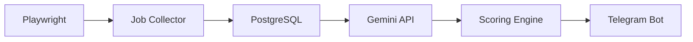

# AI Opportunity Hunter

Automatización de búsqueda de empleo para perfiles tecnológicos mediante IA, scraping web y automatización.

El sistema busca vacantes en múltiples portales (LinkedIn, Wellfound, GetOnBoard), analiza la compatibilidad con el perfil del usuario usando IA (Gemini) y notifica las mejores oportunidades vía Telegram.

## Problema

Un desarrollador debe invertir varias horas a la semana en:
- Revisar múltiples portales de empleo
- Leer cientos de ofertas manualmente
- Analizar requisitos uno por uno
- Llevar seguimiento de aplicaciones

## Solución

AI Opportunity Hunter automatiza todo el pipeline:

```
Búsqueda → Extracción → Análisis IA → Clasificación → Notificación → Seguimiento
```

## Arquitectura



## Stack tecnológico

| Capa          | Tecnología            |
|---------------|-----------------------|
| Scraping      | Python + Playwright   |
| API           | FastAPI               |
| Base de datos | PostgreSQL            |
| IA            | Gemini API            |
| Notificaciones| Telegram Bot API      |
| Infraestructura | Docker + GitHub     |

## Patrones de diseño

- Arquitectura por capas
- Repository Pattern
- Service Layer
- Dependency Injection

## MVP Fases

| Fase | Descripción | Estado |
|------|-------------|--------|
| 1 | Análisis y requisitos | ✅ En proceso |
| 2 | Diseño del sistema | ⏳ Pendiente |
| 3 | Infraestructura | ⏳ Pendiente |
| 4 | Desarrollo MVP | ⏳ Pendiente |
| 5 | Testing | ⏳ Pendiente |
| 6 | Despliegue | ⏳ Pendiente |

### Sprint 1 — Playwright (Scraper base)
Extraer ofertas de LinkedIn, Wellfound y GetOnBoard a CSV.
Sin IA, sin Telegram, sin Docker.

### Sprint 2 — Base de Datos
Persistir ofertas en PostgreSQL.

### Sprint 3 — Gemini
Analizar compatibilidad oferta vs perfil y generar score.

### Sprint 4 — Telegram
Notificar mejores oportunidades al usuario.

## Versión 2 (Futuro)

- Aplicación automática a vacantes
- Dashboard con métricas (ofertas encontradas, aplicaciones, entrevistas)
- Soporte multi-usuario

## Cómo empezar

```bash
# Clonar el repositorio
git clone https://github.com/tu-usuario/ai-opportunity-hunter.git
cd ai-opportunity-hunter

# Entorno virtual
python -m venv venv
source venv/bin/activate  # Linux/Mac
venv\Scripts\activate     # Windows

# Instalar dependencias
pip install -r requirements.txt

# Configurar variables de entorno
cp .env.example .env
# Editar .env con tus API keys

# Ejecutar scraper básico (MVP #1)
python -m backend.scrapers.linkedin
```

## Estructura del proyecto

```
ai-opportunity-hunter/
├── backend/
│   ├── scrapers/        # Playwright scrapers
│   ├── ai/              # Gemini integration
│   ├── database/        # PostgreSQL models & repositories
│   └── telegram/        # Telegram bot
├── docs/                # Documentación
├── tests/               # Pruebas
└── .github/             # Issues y templates
```

## Licencia

MIT
