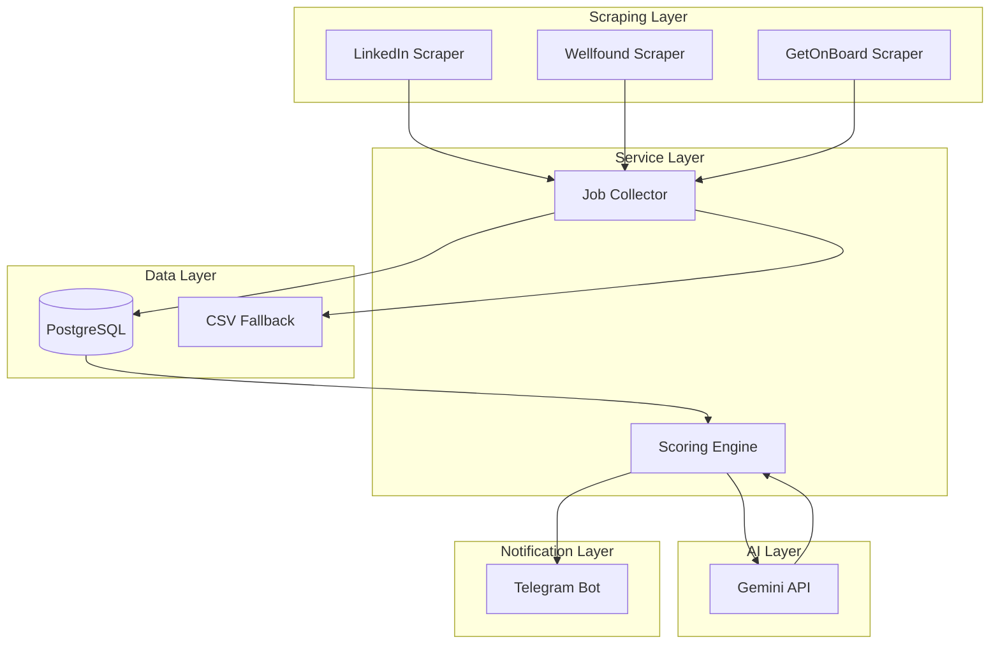
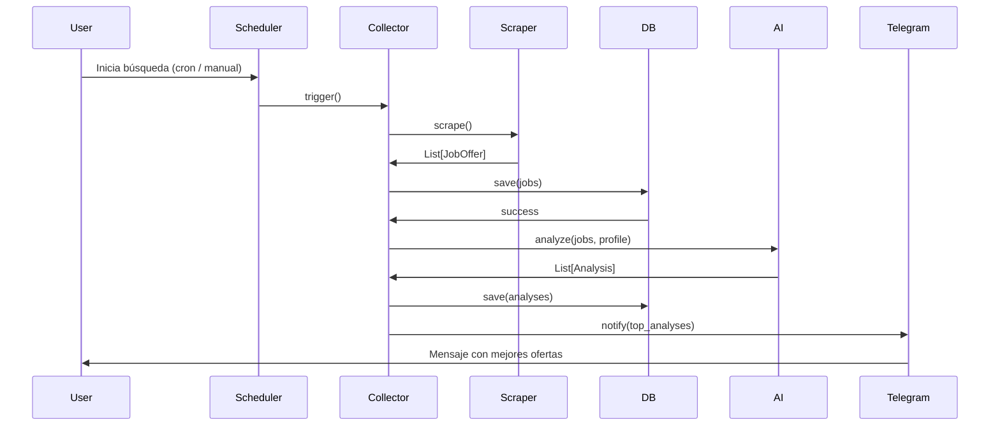

# Arquitectura del Sistema — AI Opportunity Hunter

## Diagrama de Arquitectura



## Arquitectura por Capas

### 1. Scraping Layer
- **Responsabilidad**: Navegar portales de empleo y extraer datos estructurados
- **Tecnología**: Python + Playwright
- **Componentes**: `LinkedInScraper`, `WellfoundScraper`, `GetOnBoardScraper`
- **Salida**: Diccionarios normalizados con campos: empresa, cargo, ubicación, salario, link, descripción

### 2. Service Layer
- **Responsabilidad**: Orquestar el flujo de datos entre capas
- **Patrones**: Service Layer, Dependency Injection
- **Componentes**: `JobCollectorService`, `AnalysisService`, `NotificationService`

### 3. Data Layer
- **Responsabilidad**: Persistencia de ofertas, perfiles y análisis
- **Tecnología**: PostgreSQL + SQLAlchemy
- **Patrón**: Repository Pattern
- **Componentes**: `JobRepository`, `ProfileRepository`, `AnalysisRepository`

### 4. AI Layer
- **Responsabilidad**: Analizar compatibilidad oferta-perfil usando LLM
- **Tecnología**: Gemini API
- **Componentes**: `GeminiAnalyzer`
- **Salida**: Score (0-10), fortalezas, debilidades

### 5. Notification Layer
- **Responsabilidad**: Enviar alertas al usuario
- **Tecnología**: Telegram Bot API (python-telegram-bot)
- **Componentes**: `TelegramNotifier`

## Flujo de Búsqueda Completo



## Decisiones Técnicas

| Decisión | Alternativa | Elegido | Razón |
|----------|-------------|---------|-------|
| Scraping | Selenium vs Playwright | Playwright | Más rápido, async nativo, mejor API |
| API | FastAPI vs Flask | FastAPI | Tipado, docs automáticos, performance |
| IA | OpenAI vs Gemini | Gemini | Costo más bajo, buen performance en análisis técnico |
| DB | SQLite vs PostgreSQL | PostgreSQL | Concurrencia, escalabilidad, features |

## Estrategia MVP #1

```
Playwright → Busca ofertas → Extrae datos → CSV
```

Sin IA, sin Telegram, sin Docker. Solo scraping base para validar que podemos recolectar vacantes correctamente.
