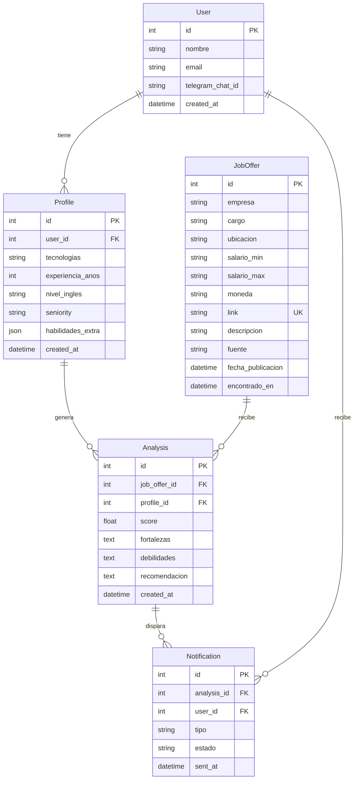

# Modelo de Datos — AI Opportunity Hunter

## Diagrama Entidad-Relación



## Tablas

### User
| Columna | Tipo | Descripción |
|---------|------|-------------|
| id | SERIAL PK | Identificador único |
| nombre | VARCHAR(255) | Nombre del usuario |
| email | VARCHAR(255) UNIQUE | Correo electrónico |
| telegram_chat_id | VARCHAR(100) | ID del chat de Telegram |
| created_at | TIMESTAMP | Fecha de registro |

### Profile
| Columna | Tipo | Descripción |
|---------|------|-------------|
| id | SERIAL PK | Identificador único |
| user_id | INT FK → User.id | Usuario al que pertenece |
| tecnologias | TEXT | Tecnologías del perfil (separadas por coma) |
| experiencia_anos | INT | Años de experiencia |
| nivel_ingles | VARCHAR(20) | Nivel de inglés (Básico, Intermedio, Avanzado, Nativo) |
| seniority | VARCHAR(50) | Junior, Semi-Senior, Senior, Lead |
| habilidades_extra | JSONB | Habilidades adicionales |
| created_at | TIMESTAMP | Fecha de creación |

### JobOffer
| Columna | Tipo | Descripción |
|---------|------|-------------|
| id | SERIAL PK | Identificador único |
| empresa | VARCHAR(255) | Nombre de la empresa |
| cargo | VARCHAR(255) | Título del cargo |
| ubicacion | VARCHAR(255) | Ubicación (remoto/híbrido/presencial + ciudad) |
| salario_min | VARCHAR(50) | Salario mínimo ofrecido |
| salario_max | VARCHAR(50) | Salario máximo ofrecido |
| moneda | VARCHAR(10) | Moneda (USD, EUR, CLP, etc.) |
| link | TEXT UNIQUE | Link a la oferta original |
| descripcion | TEXT | Descripción completa de la oferta |
| fuente | VARCHAR(50) | Portal de origen (LinkedIn, Wellfound, GetOnBoard) |
| fecha_publicacion | DATE | Fecha de publicación de la oferta |
| encontrado_en | TIMESTAMP DEFAULT NOW() | Fecha en que el sistema encontró la oferta |

### Analysis
| Columna | Tipo | Descripción |
|---------|------|-------------|
| id | SERIAL PK | Identificador único |
| job_offer_id | INT FK → JobOffer.id | Oferta analizada |
| profile_id | INT FK → Profile.id | Perfil usado para el análisis |
| score | DECIMAL(3,1) | Puntuación de compatibilidad (0.0 - 10.0) |
| fortalezas | TEXT | Fortalezas del perfil para esta oferta |
| debilidades | TEXT | Debilidades o brechas del perfil |
| recomendacion | TEXT | Recomendación generada por IA |
| created_at | TIMESTAMP | Fecha del análisis |

### Notification
| Columna | Tipo | Descripción |
|---------|------|-------------|
| id | SERIAL PK | Identificador único |
| analysis_id | INT FK → Analysis.id | Análisis que disparó la notificación |
| user_id | INT FK → User.id | Usuario destinatario |
| tipo | VARCHAR(50) | Tipo (nueva_oferta, score_alto, seguimiento) |
| estado | VARCHAR(20) | Estado (pending, sent, failed) |
| sent_at | TIMESTAMP | Fecha de envío |

## Índices Recomendados

```sql
CREATE INDEX idx_joboffer_link ON JobOffer(link);
CREATE INDEX idx_joboffer_fuente ON JobOffer(fuente);
CREATE INDEX idx_analysis_score ON Analysis(score DESC);
CREATE INDEX idx_analysis_profile ON Analysis(profile_id);
CREATE INDEX idx_notification_user ON Notification(user_id, estado);
```
